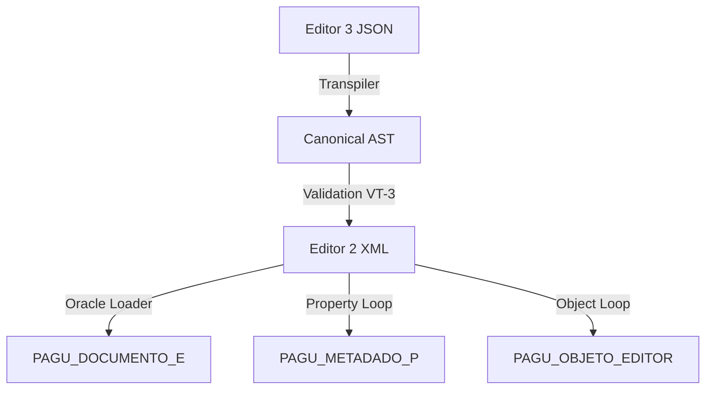

# FORENSIC MASTER BLUEPRINT: EDITOR MV SOUL (V2 & V3)
**Versão**: 1.0 (QCS-Ω)
**Classificação**: Missão Crítica / Forense de Dados
**Responsabilidade**: MV-Antigravity Architect

---

## 1. Anatomia Atômica do Objeto (CD_PROPRIEDADE 1-43)

A persistência de um componente no Oracle (`PAGU_OBJETO_EDITOR`) não armazena o "estado" visual, mas sim uma coleção de fragmentos de metadados.

### 1.1 Dicionário de "Parafusos" (Metadados de Persistência)

| ID | Atributo Técnico | Função na Persistência Oracle | Comportamento Legado (Imutável) |
| :--- | :--- | :--- | :--- |
| **1** | `Tamanho` | `VL_TAMANHO` (VARCHAR2) | Restrição física de input no RDBMS. |
| **2** | `Lista Valores` | `DS_LISTA_VALORES` | Domínio discreto. Formato: `val=label\|val2=label2`. |
| **3** | `Máscara` | `DS_MASK` | Validação de Regex. Ex: `DD/MM/YYYY`. |
| **4** | `Ação (SQL)` | `DS_ACTION` | SQL executado via `DUAL` para população dinâmica. |
| **7** | `Editável` | `SN_EDITAVEL` | Bloqueio de focus no componente. |
| **8** | `Obrigatório` | `SN_OBRIGATORIO` | Gera restrição `NOT NULL` virtual na submissão. |
| **9** | `Valor Inicial` | `VL_DEFAULT` | **INTEGRIDADE**: Espaço `' '` é logicamente diferente de `NULL`. |
| **17** | `Reprocessar` | `SN_REFRESH` | Gatilho de recálculo de dependências. |
| **21** | `Ação SQL` | `DS_EXEC_SQL` | Lógica de evento `ON_CHANGE`. |
| **30** | `Hint` | `DS_HELP_TEXT` | Texto de auxílio armazenado como CLOB em alguns casos. |
| **34** | `Opaque Script` | `LO_EDT_JAVA` | **REVERSÃO**: Binário Jasper (LO_REL_COMPILADO). |
| **38** | `Cascata` | `SN_ITERATIVE` | **ORACLE_SHADOW**: Bit de terminação de loops de UI. |

---

## 2. A Matriz de Prefixos (Naming Logic)

O motor de renderização associa prefixos literais ao tipo de objeto para mapear o resultado final no banco de dados.

| Prefixo | Significado | Tipo SQL | Mapeamento Editor 3 |
| :--- | :--- | :--- | :--- |
| **TXT_** | Text Input | `VARCHAR2` | `TEXT` |
| **CMB_** | ComboBox | `NUMBER/VARCHAR2`| `COMBOBOX` |
| **CHB_** | CheckBox | `VARCHAR2(1)` | `CHECKBOX` (S/N) |
| **RDB_** | RadioButton | `NUMBER` | `RADIOBUTTON` |
| **DT_** | DatePicker | `DATE` | `DATE` |
| **LBL_** | Label | `N/A` | `FORMATTEDTEXT` (Prop 14) |
| **SHP_** | Shape/Rect | `N/A` | `RECT` |

---

## 3. Serialização de Conteúdo & Integridade

### 3.1 Transpilação de Escape
- **XML (Legado)**: Utiliza standard entity escaping para PL/SQL.
- **JSON (Moderno)**: O campo `version.content` utiliza **Double Serialization**. O objeto de layout é convertido em string, escapado e então inserido no JSON principal.
- **Hash MD5**: `MD5(minified_json_structure)`. A falha de 1 bit no hash impede a edição do documento no Editor 3.

### 3.2 Lógica Injetada (Gatilhos de Contexto)
Macros nativas são substituídas em tempo de execução pelas variáveis de sessão do Oracle:
- `&<PAR_CD_ATENDIMENTO>` -> Numero do Atendimento do Paciente.
- `&<PAR_USUARIO_LOGADO>` -> Login do Prestador.

---

## 4. Layout & Tipografia (Crucible Matrix)

### 4.1 Cálculo de Coordenadas
A transposição de layout do Editor 2 (baseado em Jasper) para o Editor 3 (Moderno) segue a paridade de impressão A4:
- **Resolução Base**: 96 DPI.
- **Coordenada X (mm)**: $(X[px] / 96.0) * 25.4$
- **Foco Automático**: Determinado pela ordem cronológica de inserção no XML legaddo se o `tabIndex` for nulo.

---

## 5. Mapa de Persistência Drástica

---

## 🛡️ Protocolo de Validação VT-3 (Regras de Ouro)

1. **Camada de Coerção**: Todo booleano deve persistir como `'S'` ou `'N'`. Nunca `True/False` literais.
2. **Camada de Sanidade**: Queries SQL com aspas simples (`'`) devem sobreviver ao escape XML sem se tornarem `&amp;quot;`.
3. **Vault Integrity**: O node `LO_REL_COMPILADO` deve ser considerado "Sacrossanto". Se não puder ser processado, deve ser reinjetado via Fallback Binário estrutural.

---

## 🚶 Walkthrough da Jornada do Dado

1. **Alteração na UI**: O usuário digita no campo `TXT_PESO`.
2. **Gatilho**: O evento `ON_CHANGE` dispara o `rule_lexer.py`.
3. **Avaliação**: O motor verifica a propriedade 38 (`cascata_regra`). Se `True`, recalcula dependentes.
4. **Serialização**: O `xml_serializer.py` gera o envelope com `win-1252` encoding.
5. **Persistência**: O SQL realiza o `UPDATE` na `PAGU_METADADO_P` filtrando por `CD_PROPRIEDADE = 9` (Valor Inicial/Atual).
6. **Commit**: O Oracle dispara a Trigger de Auditoria, gravando o `CD_USUARIO` (Propriedade 10).

**Fim do Relatório.**
