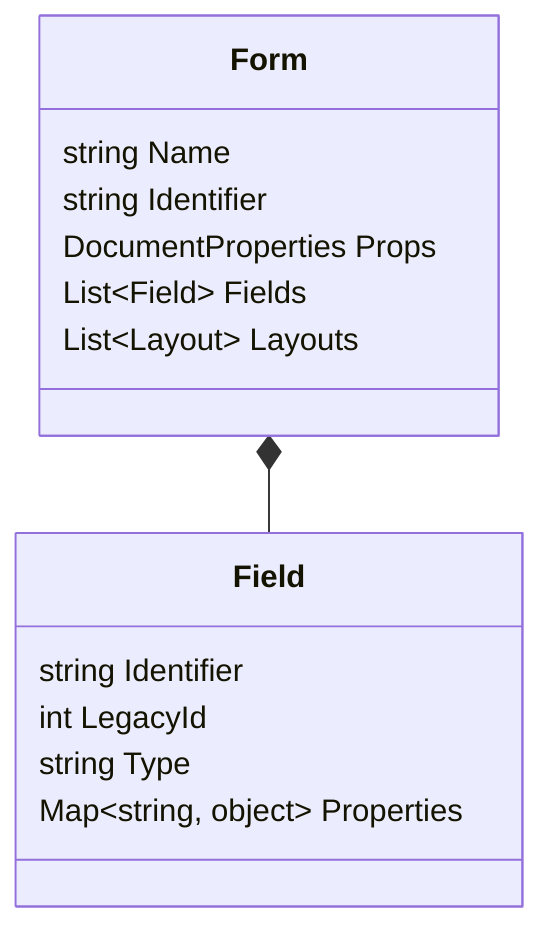

# Architecture: ReplicaEditor Hybrid Core

## Objective
Enable a single "Canonical Model" in memory to be exported to two distinct formats:
1.  **Editor 2 (Legacy XML)**: Database-centric, hierarchical ROWSETs, numeric IDs.
2.  **Editor 3 (Modern JSON)**: Object-centric, semantic identifiers, security hashing.

## 1. The Canonical Model (In-Memory)
A structurally neutral representation of a form. It captures the *intent* of the form rather than the specific serialization format.

### Key Considerations
-   **Dual Identity**: Every generic object (Field, Property) must store both its `Identifier` (for V3) and `LegacyId` (for V2) if known, or look it up via the Dictionary.
-   **Rich Content**: Stores full layout metadata (coordinates, size).

## 2. Driver Architecture

### Driver Interface
All drivers must implement a standard export contract:
`Export(Form canonicalForm) -> FileArtifact`

### Driver V2: "The Typewriter" (XML/Legacy)
*Target: Database Compatibility (ROWSET/ROW)*
-   **Structure**: Generates XML mirroring the `EDITOR_CUSTOM` tables.
-   **Logic**:
    -   Maps canonical fields to `<CD_CAMPO>` (requires lookups).
    -   Flattens object structures into parent-child relationships (fk_parent).
    -   **Degradation**: If a V3-only feature (e.g., "Flex Container") is encountered, it must:
        1.  Log a warning.
        2.  Fallback to a standard container or ignore the layout attributes, preserving the data field itself.
-   **Security**: No hashing required.
-   **Binary Wrapper**: O arquivo `.edt` Legado **NÃO É XML PURO**.
    -   **Magic Number**: Inicia com `ACED0005` (Java Serialization).
    -   **Pre-processamento**: O Importer deve realizar um "Binary Scrubbing" para extrair o conteúdo XML/Jasper embutido antes de chamar o parser.

### Driver V3: "The eBook" (JSON/Modern)
*Target: Web/Mobile Rendering (.edt/.json)*
-   **Structure**: Generates the JSON object structure (`identifier`, `version`, `layouts`).
-   **Logic**:
    -   Uses textual `identifier` (e.g., "obrigatorio").
    -   **Security**: MUST calculate MD5 hashes for:
        -   Every individual field property value.
        -   The final `version.hash` (using the `MD5(Minified(Data))` algo validated in Fixpack D).
    -   **Layout (Matrioska)**: O campo `layouts.content` **NÃO É UM OBJETO**. Ele deve ser uma **STRING JSON stringificada**. O sistema realiza `JSON.parse()` duas vezes.

## 3. The Dictionary (Rosetta Stone)
A static lookup service to bridge the two worlds.

| Concept | V2 ID (int) | V3 Identifier (string) | Type |
| :--- | :--- | :--- | :--- |
| Obrigatório | 8 | `obrigatorio` | boolean |
| Editável | 17 | `editavel` | boolean |
| Tamanho | 1 | `tamanho` | integer |
| Máscara | 3 | `mascara` | string |
| Ação SQL | 21 | `acaoSql` | string |
| Lista Val | 25 | `listaValores` | array |

**Responsibility**:
-   `GetId(identifier)`: Returns 8 for "obrigatorio".
-   `GetIdentifier(id)`: Returns "obrigatorio" for 8.

## 4. User Workflow
1.  **Input**: User defines form (DSL, GUI, or imported file).
2.  **Process**: Validates against Canonical Rules.
3.  **Output Choice**:
    -   [Export V2]: Generates XML for older MV versions.
    -   [Export V3]: Generates signed JSON for MV Soul/Flow.

## 5. Resilience Strategy
-   **V3 Features in V2**:
    -   *Scenario*: "Tabs Layout" (not in V2).
    -   *Action*: Export fields sequentially (vertical list).
-   **V2 Constraints in V3**:
    -   *Scenario*: V2 `tamanho` limit.
    -   *Action*: V3 respects it (Validation Rule).
