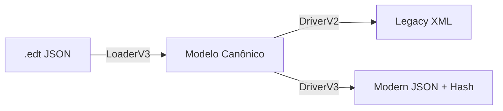

# 02 - Fluxo de Dados e Lógica

Autor: Agente Antigravity (via NotebookLM)
Data: 2026-02-18

## 1. Visão Macro: O Pipeline Híbrido
O sistema opera transformando dados de formatos específicos (XML/JSON) para um formato neutro ("Canônico") e depois re-exportando.

## 2. Componentes e Conexões

### A. Entrada (LoaderV3)
- **Input**: Arquivo JSON do Editor 3.
- **Lógica**: 
  1. Parse do JSON.
  2. Varredura de `propertyDocumentValues`.
  3. Uso da **RosettaStone** para traduzir Identificadores textuais ("obrigatorio") para IDs numéricos internos.
  4. Criação de objetos `CanonicalField` e `CanonicalForm`.

### B. O Modelo Canônico (CanonicalModel)
A estrutura de dados em memória.
- **Validação**: Ao criar um campo, ele valida prefixos obrigatórios (`TXT_`, `CBB_`, etc.).
- **Agnosticismo**: Não guarda detalhes de *como* o dado será salvo, apenas *o que* ele é.

### C. A Pedra de Roseta (RosettaStone)
O cérebro de tradução.
- **Mapeamento Estático**: Sabe que `ID 8` é Boolean "obrigatorio".
- **Inteligência de Compatibilidade**: Diferencia `ID 2` (Array Moderno) de `ID 25` (String Legada "pipe-separated").

### D. Drivers de Saída (Drivers)

#### Driver V2 (XML)
- **Degradação Graciosa**: Se encontra um Array moderno (ID 2), ele converte para String separada por pipes (`A|B`) para não quebrar o XML legado.
- **Formato**: Gera estrutura `<ROWSET>` compatível com banco de dados Oracle/MV.

#### Driver V3 (JSON)
- **Integridade**: Aplica o algoritmo de Hash Reverso descoberto na Fase 1.
- **Algoritmo de Hash**: 
  - `Hash Propriedade`: MD5(Valor.ToString()).
  - `Hash Versão`: MD5(JSON Minificado do objeto `data`).

## 3. Interações Críticas
1. **Validação de Tipos**: O `CanonicalProperty` usa a `RosettaStone` para impedir que você salve um texto num campo booleano (ex: "Talvez" no campo Obrigatório).
2. **Preservação de Ordem**: O `CanonicalForm` usa listas ordenadas para garantir que os campos saiam na mesma ordem que entraram.
